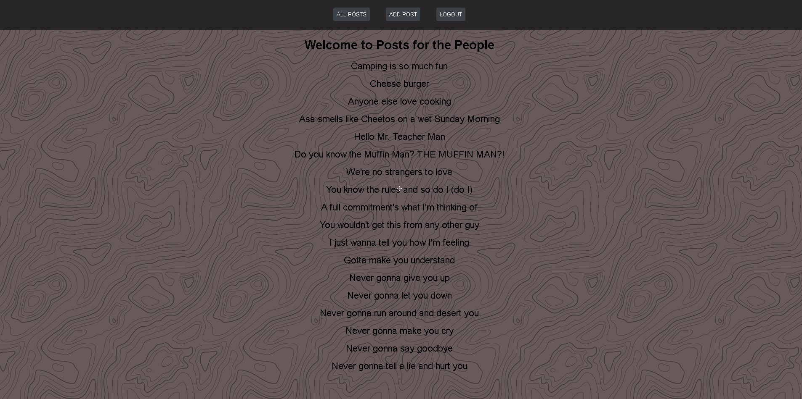

# Posts for the People
## Welcome to Posts for the People! This Node.js Express application allows users to share and interact with posts, fostering a community where people can express their thoughts and opinions.

## [Posts-For-The-People](https://posts-unit-2-project.fly.dev)

# Icebox items 
## Create the ability to go to a page and view a list of all profiles on the site, including every user who has created an account.
## Have a detailed profile page
## The abilty to delete anything the user has made from the profile page
## Like and dislike tracker

## Project Planning Materials 
## [Trello](https://trello.com/b/tpo4sLcq/note-pad-sei-unit-2-project)
## [Whimsical](https://whimsical.com/RSCwstvJKkqMS2ev8xovDT)

# Resources used
## [Mozilla Developer](https://developer.mozilla.org/en-US/)

# Attributions
[Button Styling](https://getcssscan.com/css-buttons-examples)

# Technologies used

